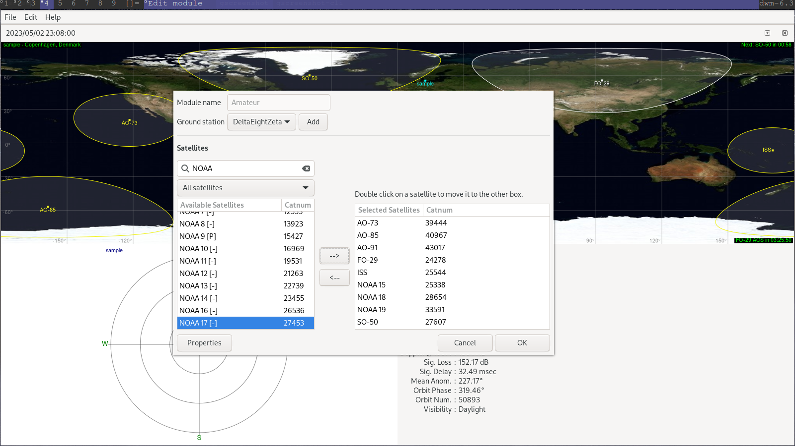

# Receiving NOAA APT Transmissions

A Guide by Delta, Eight, Zeta

## Requirements

* A Software Defined Radio
* A Computer or Raspberry Pi
* An Antenna (Or one we will make later in the guide)

### Lets Start Simple

If you want to be able to use your sdr, you need a SDR application to control it, I would reccomend SDR Sharp, GQRX (If you use linux), SDR++, AngelSDR,HDSDR, SDR UNO,GNU-Radio (more so a development ecosystem). There are many others but I would not worry about those. Personally I use SDR# (sharp) and GQRX for my RTL-SDR.

The second piece of software you will need is [NOAA-APT decoder](https://noaa-apt.mbernardi.com.ar/) Which is my choice in APT decoding software for these NOAA images, it includes false color and map overlay. It is a great piece of software compared to the abandonware WXTOIMG which is great for overlays but is very picky in everything else.

## So You Need an Antenna

There are many antenna that can pick up the kind of signal we want, which is a right handed circularly polarized signal, it looks like this:

Which is picky to pick up but we can do it. The most available antenna that can do that is a rabbit ear dipole or "V-Dipole": It looks like this and is super simple to make. In fact the RTL-SDR kit comes with an adjustable antenna that is fully capable of doing this, in fact, my photos up by the title, were took, with those.

If you have a compass, it should be easy to line up the 120 and 240 as the 240 degree open side will be lined up with the bearing of 0, I use a lensatic engineers compass however a phone works too.

## I have an antenna, how do I receive already?

Well, you need to know when and which satellite will pass by soon. Passes are frequent so don't lose sleep over missing one.

More software, GPredict, this is linux software, [GPredict](http://gpredict.oz9aec.net/download.php), NOAA satellites are not on by default, however you just open the module manager and add them easily. You may have to refresh your data.

For Windows, try [PreviSat](https://previsat.sourceforge.net/), It seems to be very similar.

If you click on a satellite it will tell you the next "Event" which is when you will get a signal from the transponders on the satetllite. Which looks like this:

We are interested in the APT as that is Automatic Picture Tranmission.

## You know when the satellite comes, now lets get data

Most SDR software have record functions, these differ for all however they should record the audio. **Important: APT signals work in [WFM mode with AM modulation](https://www.sigidwiki.com/wiki/Automatic_Picture_Transmission_(APT))**, Record your APT data from the satellite at the time GPredict told you until the end of your pass.

## Lets make an Image!
Almost There!
NOAA APT decoder is very straightforward but just in case:
In the end you should have a around 10 minute audio file. Because we are using NOAA APT decoder rather than WXTOIMG we just throw our audio into it through the input file section after you start the app, You press decode, then you go through your options and etc for how you want your map and a raw image file should look something like this:

The image by the title is what it looks like when you have false color turned on, I personally don't use map overlay because I feel like it takes away from the image. However its all your choice.

# Congratulations,I hope this guide helped you out. Feel free to contribute to it by adding more sections!
